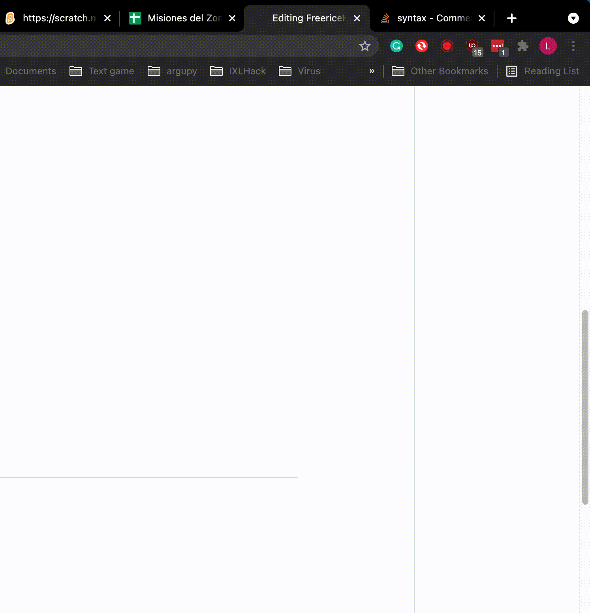
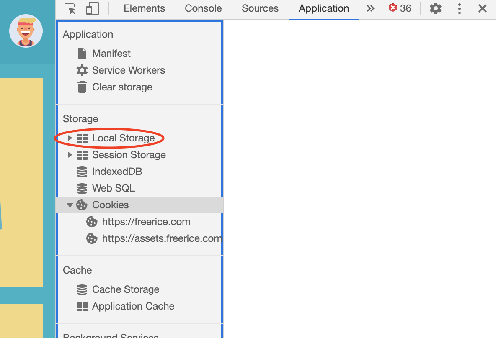

# FreericeHack
A hack for https://freerice.com (useful if you want to beat BTS ARMY)

## Usage
### Python3
1. Install [Python3](https://python.org) (if not already installed)
2. Open a terminal and run `pip3 install requests torpy`
   - If that doesn't work, try `python3 -m pip install requests torpy` or `python -m pip install requests torpy`
3. Download [Freerice.py](Freerice.py) and [Requester.py](Requester.py)
   - Make sure their extensions are `.py` (and not `.txt` or without an extension)
4. In the terminal, go to your downloads folder
   - Windows: `cd ~\Downloads`
   - Mac/Linux: `cd ~/Downloads`
5. Run `python3 Requests.py -u your_user_id` (see the [User ID](#user-id)s section)
   - If that doesn't work, try `python Requests.py -u your_user_id`
6. Watch your amount of rice grow. But remember to open the [Freerice website](https://freerice.com) so they have some kind of income.

**Note:** if you get blocked very quickly, try running it with an interval of 4 seconds: `python3 Requests.py -i 4`
<br>
You can change it if you want to whatever amount of seconds to wait between question.

### Android app (APK)
1. Download our [most recent APK](Client_APK/FreericeHack_v1_2.apk) to your phone
2. Go to your downloads and install it

### JavaScript (automatic)
1. Go to the [multiplication table category](https://freerice.com/categories/multiplication-table) in Freerice.
2. Open your browser's console (see [Opening the console](#opening-the-console)).
3. Copy all the code from [Client_JavaScript/interval.js](Client_JavaScript/interval.js).
4. Paste it into the console and press `Enter`.
5. The correct answers will be clicked automatically.

### JavaScript (on spacebar)
1. Go to the [multiplication table category](https://freerice.com/categories/multiplication-table) in Freerice.
2. Open your browser's console (see [Opening the console](#opening-the-console)).
3. Copy all the code from [Client_JavaScript/spacebar.js](Client_JavaScript/spacebar.js).
4. Paste it into the console and press `Enter`.
5. Close the console and click anywhere on the Freerice page.
6. Press the spacebar and the correct answer will be clicked automatically.

## Opening the console
### Chrome


## User ID
### Chrome
1. Go to [Freerice.com](https://freerice.com)
2. Open the console (see [Opening the console](#opening-the-console))
3. Go to the `application` section
4. Open the `Local storage` menu on the left, and select `https://freerice.com`
<br><br>
5. Double-click on the `user` value, and you'll see a JSON like this:
   ```
   {
     "token": "...",
     "uuid": "..."
   }
   ```
6. Copy the value in `uuid`
